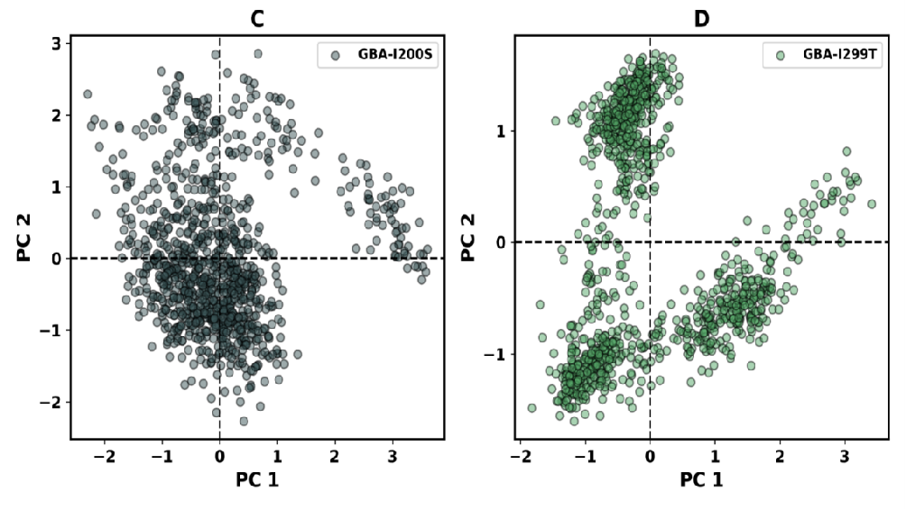
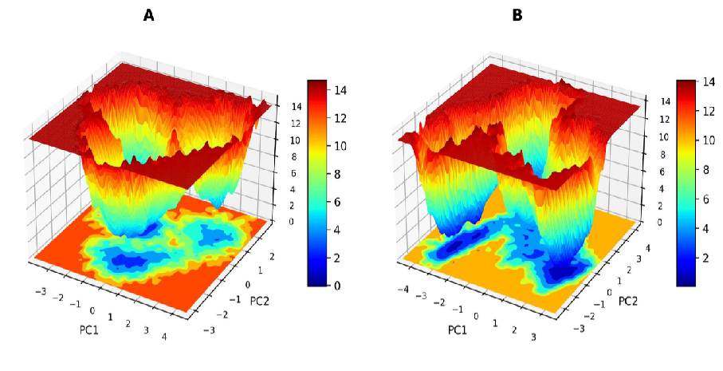
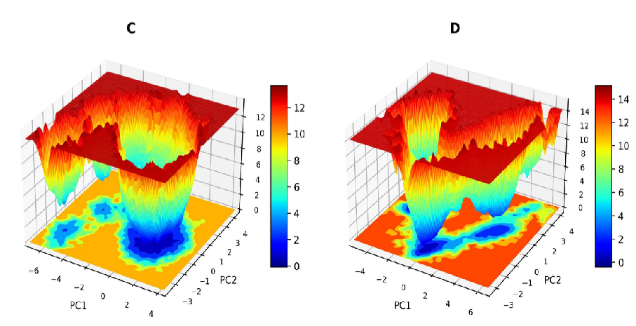

# GBA1-SNP-Analysis-Molecular-Dynamics
Identification of deleterious SNPs in GBA1 gene and structural impact analysis using molecular dynamics simulations

# Identification of Deleterious SNPs in GBA1 Gene and Structural Impact Analysis
## 🚀 Key Result
Identified deleterious SNPs in GBA1 gene that significantly destabilize protein structure, as confirmed through molecular dynamics simulations showing increased fluctuations and reduced stability in mutant variants.

## 🔬 Project Highlights
- Analyzed 4922 SNPs in GBA1 gene to identify deleterious mutations
- Identified 530 missense SNPs and screened for disease relevance
- Performed sequence-based and structure-based prediction analysis
- Conducted molecular dynamics simulations to study protein stability
- Evaluated structural deviations using RMSD, RMSF, Rg, SASA, PCA, and FEL

## 🧬 Overview
This project focuses on identifying deleterious single nucleotide polymorphisms (SNPs) in the GBA1 gene associated with Gaucher disease.

A combination of sequence-based and structure-based computational tools were used to predict mutations affecting protein stability. Further, molecular dynamics simulations were performed to analyze structural changes caused by mutations.

## 🧪 Tools Used

### Sequence-Based Analysis
- PolyPhen-2
- SIFT
- FATHMM
- SNP&GO
- SNAP
- Meta-SNP
- PANTHER
- PhD-SNP

### Structure-Based Analysis
- I-Mutant
- Mupro
- DUET
- I-Stable
- DynaMut2

### Molecular Dynamics
- GROMACS

## ⚙️ Methodology

### 1. Data Collection
- Retrieved SNP data from NCBI
- Filtered missense SNPs for further analysis

### 2. Sequence-Based Prediction
- Evaluated deleterious SNPs using multiple prediction tools

### 3. Structural Analysis
- Assessed protein stability changes using structure-based tools

### 4. Molecular Dynamics Simulation
- Simulated wild-type and mutant proteins
- Analyzed structural behavior using:
  - RMSD (stability)
  - RMSF (flexibility)
  - Radius of gyration (compactness)
  - SASA (surface exposure)
  - Hydrogen bonding interactions
  - PCA (conformational changes)
  - Free Energy Landscape (FEL)

## 📊 Molecular Dynamics Analysis

### RMSD

RMSD analysis was performed to evaluate the overall structural stability of the protein during the simulation.  
The mutant proteins exhibited higher RMSD values compared to the wild-type, indicating greater structural deviation over time.  
This suggests reduced stability and conformational changes in the protein due to the presence of mutations.

### RMSF

RMSF analysis was performed to evaluate residue-level flexibility of the protein.  
The mutant variants exhibited higher fluctuations compared to the wild-type protein, indicating increased structural flexibility and potential instability in specific regions.  
This suggests that mutations may disrupt local structural integrity and affect protein function.

### Radius of Gyration

The radius of gyration was analyzed to assess the compactness of the protein structure during simulation.  
Mutant proteins showed variations in Rg values compared to the wild-type, indicating changes in structural compactness.  
An increase in Rg suggests reduced folding stability and a more expanded protein conformation.

### SASA

SASA analysis was conducted to evaluate the surface exposure of the protein to the solvent.  
Mutant structures exhibited altered SASA values, indicating changes in protein folding and exposure of hydrophobic regions.  
This suggests that mutations may lead to destabilization and affect protein–environment interactions.

### PCA

PCA was performed to study large-scale conformational movements of the protein.  
The projection plots revealed distinct conformational spaces for mutant and wild-type proteins.  
Mutants showed greater conformational variation, indicating altered dynamic behavior and reduced structural stability.

### Free Energy Landscape

The free energy landscape analysis was used to identify stable conformational states of the protein.  
Mutant proteins displayed altered energy minima compared to the wild-type, indicating changes in stability and folding patterns.  
These variations suggest that mutations may shift the protein toward less stable conformations.

Overall, molecular dynamics analysis indicates that mutations lead to increased flexibility, reduced stability, and altered conformational behavior of the protein.

## 📊 Results

- Identified key deleterious SNPs affecting protein stability
- Structural analysis showed destabilizing mutations
- Molecular dynamics revealed:
  - Increased fluctuations in mutant proteins
  - Reduced structural stability
  - Altered conformational behavior

## 🧠 Key Findings
- Certain SNPs significantly impact protein stability and function
- Mutations lead to structural deviation from native state
- These changes may contribute to Gaucher disease pathology

## 🧠 Skills Demonstrated
- SNP Analysis
- NGS Data Interpretation
- Structural Bioinformatics
- Molecular Dynamics Simulation
- Protein Stability Analysis

## 📌 Conclusion
This study highlights the importance of identifying deleterious SNPs and understanding their structural impact using computational approaches. The findings provide insights into mutation-induced protein instability in Gaucher disease.

## Author
Harini R
