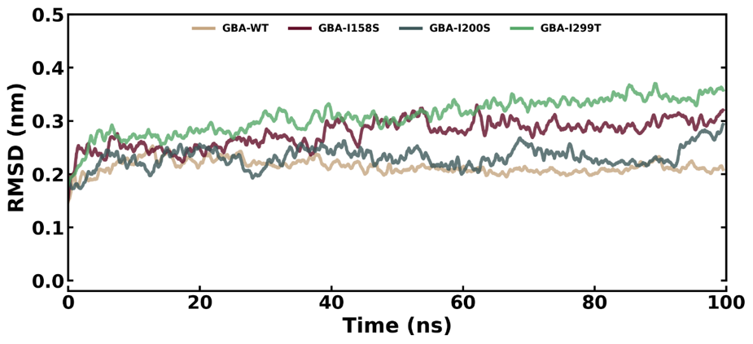
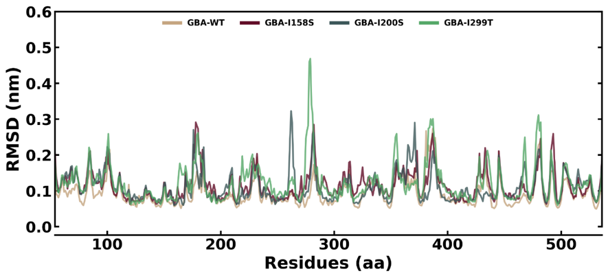
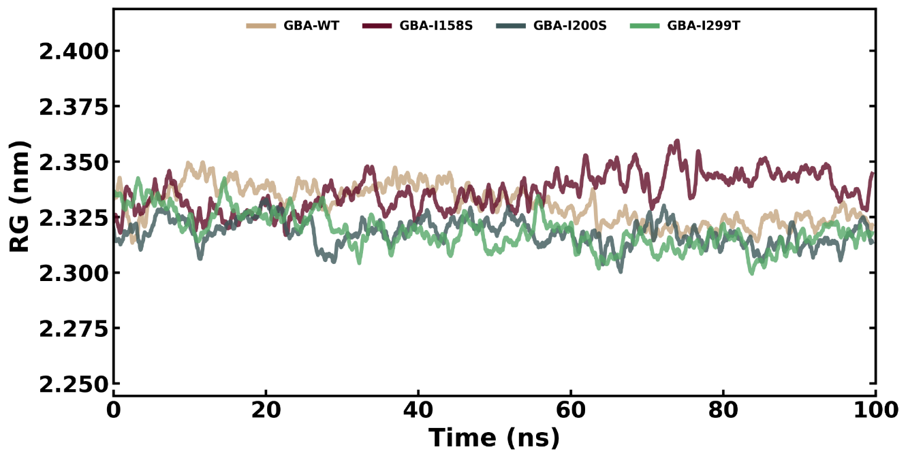
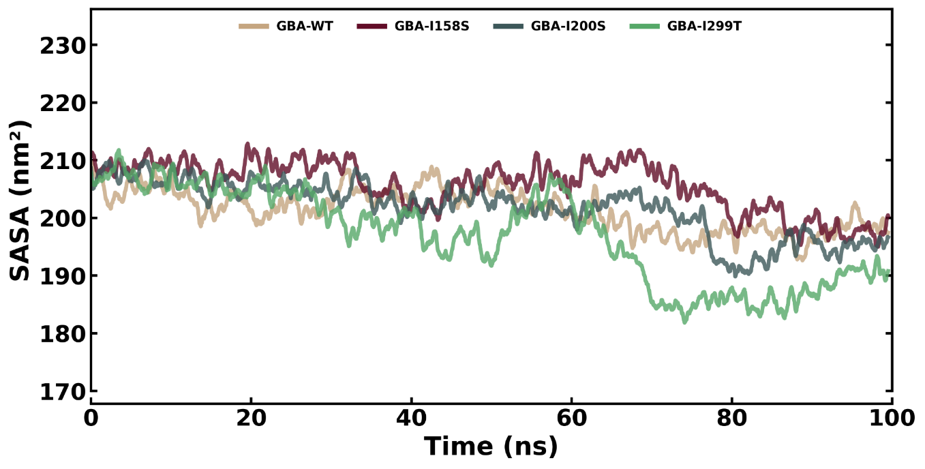
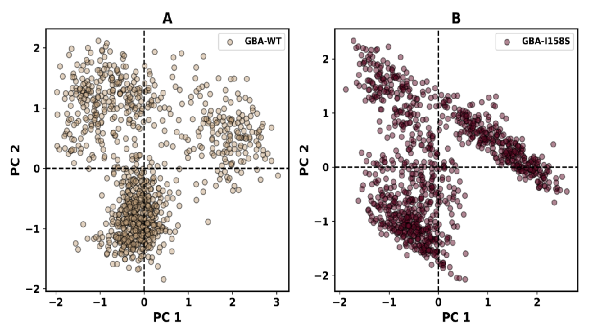

# GBA1-SNP-Analysis-Molecular-Dynamics
Identification of deleterious SNPs in GBA1 gene and structural impact analysis using molecular dynamics simulations

# Identification of Deleterious SNPs in GBA1 Gene and Structural Impact Analysis

## 🔬 Project Highlights
- Analyzed 4922 SNPs in GBA1 gene to identify deleterious mutations
- Identified 530 missense SNPs and screened for disease relevance
- Performed sequence-based and structure-based prediction analysis
- Conducted molecular dynamics simulations to study protein stability
- Evaluated structural deviations using RMSD, RMSF, Rg, SASA, PCA, and FEL

## 🧬 Overview
This project focuses on identifying deleterious single nucleotide polymorphisms (SNPs) in the GBA1 gene associated with Gaucher disease.

A combination of sequence-based and structure-based computational tools were used to predict mutations affecting protein stability. Further, molecular dynamics simulations were performed to analyze structural changes caused by mutations.

## 🧪 Tools Used

### Sequence-Based Analysis
- PolyPhen-2
- SIFT
- FATHMM
- SNP&GO
- SNAP
- Meta-SNP
- PANTHER
- PhD-SNP

### Structure-Based Analysis
- I-Mutant
- Mupro
- DUET
- I-Stable
- DynaMut2

### Molecular Dynamics
- GROMACS

## ⚙️ Methodology

### 1. Data Collection
- Retrieved SNP data from NCBI
- Filtered missense SNPs for further analysis

### 2. Sequence-Based Prediction
- Evaluated deleterious SNPs using multiple prediction tools

### 3. Structural Analysis
- Assessed protein stability changes using structure-based tools

### 4. Molecular Dynamics Simulation
- Simulated wild-type and mutant proteins
- Analyzed structural behavior using:
  - RMSD (stability)
  - RMSF (flexibility)
  - Radius of gyration (compactness)
  - SASA (surface exposure)
  - Hydrogen bonding interactions
  - PCA (conformational changes)
  - Free Energy Landscape (FEL)

## 📊 Molecular Dynamics Analysis

### RMSD

### RMSF

### Radius of Gyration

### SASA

### PCA

### Free Energy Landscape

## 📊 Results

- Identified key deleterious SNPs affecting protein stability
- Structural analysis showed destabilizing mutations
- Molecular dynamics revealed:
  - Increased fluctuations in mutant proteins
  - Reduced structural stability
  - Altered conformational behavior

## 🧠 Key Findings
- Certain SNPs significantly impact protein stability and function
- Mutations lead to structural deviation from native state
- These changes may contribute to Gaucher disease pathology

## 🧠 Skills Demonstrated
- SNP Analysis
- NGS Data Interpretation
- Structural Bioinformatics
- Molecular Dynamics Simulation
- Protein Stability Analysis

## 📌 Conclusion
This study highlights the importance of identifying deleterious SNPs and understanding their structural impact using computational approaches. The findings provide insights into mutation-induced protein instability in Gaucher disease.

## Author
Harini R
